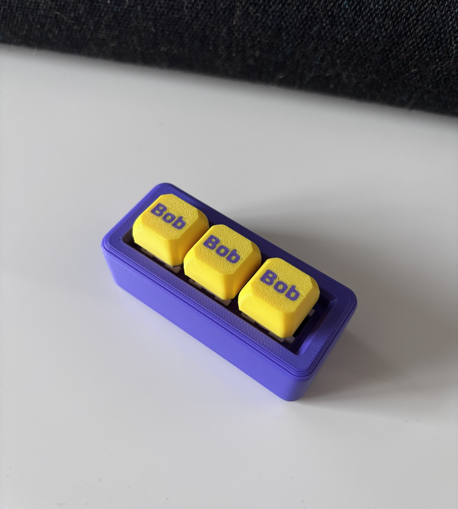

# nRF52840 Bluetooth Page Turner



A three-button Bluetooth page turner built with an nRF52840 board and CircuitPython.

I originally built this for my jailbroken Kindle, based on a Bluetooth Page Turner project on MakerWorld. I used a different nRF52840 board that was easier to find in Europe and added a third button, so I adapted the pin mapping and firmware for my build.

The page turner automatically enters deep sleep after 10 minutes of inactivity and wakes when any of the three buttons is pressed. After waking, it reconnects via Bluetooth and is ready to use again.

## Features

- 3 physical buttons
- Bluetooth HID keyboard
- Previous page / Enter / Next page
- Automatic deep sleep after 10 minutes
- Wake from deep sleep with any button
- Automatic Bluetooth reconnection
- Customizable Bluetooth device name
- Customizable sleep timeout
- CircuitPython

## Hardware

My build uses:

- nRF52840 ProMicro / SuperMini-style development board
- 3 mechanical switches
- 3.7 V LiPo battery
- 3D-printed enclosure
- Custom keycaps

The GPIO pins used in my build are:

| Button | GPIO | HID key |
|---|---|---|
| 1 | `P0_20` | Left Arrow |
| 2 | `P1_00` | Enter |
| 3 | `P1_06` | Right Arrow |

All three buttons use the internal pull-up resistors and connect to GND when pressed.

> **Note:** Pin mappings can differ between nRF52840 boards and clones. Check your board before using these GPIO assignments.

## Software

The firmware runs on CircuitPython and requires:

- `adafruit_ble`
- `adafruit_hid`

Copy the required libraries into the `lib` directory on your `CIRCUITPY` drive.

Then copy `code.py` to the root of `CIRCUITPY`.

The device will advertise as a Bluetooth HID keyboard and can then be paired with a Kindle or another compatible device.

## Customization

### Bluetooth Device Name

By default, the device appears as:

```python
DEVICE_NAME = "BT page turner"
```

You can change the Bluetooth name to anything you like by editing this line in `code.py`.

For example:

```python
DEVICE_NAME = "Bob"
```

### Sleep Timeout

By default, the page turner enters deep sleep after 10 minutes without a button press:

```python
SLEEP_AFTER = 600
```

The value is in seconds, so you can change it to any timeout you prefer.

For example, for 5 minutes:

```python
SLEEP_AFTER = 300
```

Pressing any of the three buttons wakes the board from deep sleep.

### Button Pins and Keys

The GPIO pins and HID keys can also be changed in `code.py` if you use a different board or want different button functions.

This build uses:

- `P0_20` → Left Arrow
- `P1_00` → Enter
- `P1_06` → Right Arrow

## Bluetooth Troubleshooting

If you remove the page turner from the paired-device list on the host and it no longer appears when scanning, the old Bluetooth bonding information may still be stored on the nRF52840.

Open the CircuitPython REPL and run:

```python
import _bleio
_bleio.adapter.erase_bonding()
```

Then press `Ctrl+D` to reboot CircuitPython and pair the device again.

## Original Project

This build is based on the Bluetooth Page Turner project on MakerWorld:

https://makerworld.com/models/3211959

Thanks to the original creator for sharing the design and firmware!

## My Build

I modified the original enclosure slightly to fit my components and used custom-generated keycaps for the three-button version.

And yes, all three buttons are named Bob.

**Bob. Bob. Bob.**
